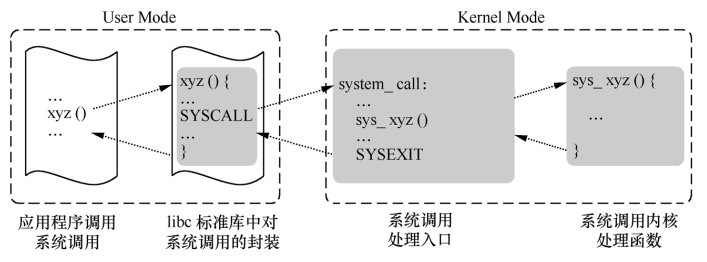

<head><meta charset="UTF-8"></head>
<style>
h1 {
    text-align: center;
    border-left: 5px solid #e86422;
    border-right: 5px solid #e86422;
}
h2 {
    border-left: 5px solid #ff7f00;
    padding-left: 10px;
}
h3 {
    border-left: 5px solid #e86422;
    padding-left: 8px;
}
h4 {
    border-left: 3px solid #f0a000;
    padding-left: 5px;
}
</style>

Release log:
> 2021-06-02 三: 完成初版

# Linux 系统调用简析

## 参考
《庖丁解牛 Linux 内核分析》

## 用户态、内核态和中断
现代 CPU 一般都有几种不同的指令执行级别，在高的执行级别下，代码可以执行特权指令，访问任意的物理内存。Intel x86 CPU 有 4 种不同的执行级别，分别是 0、1、2、3，数字越小，权限越高。Linux 操作系统中只采用了其中的 0 和 3 两种特权级别，分别对应内核态和用户态。用户态和内核态很显著的区分方法就是 CS:EIP 的指向范围。在 32 位 x86 机器上有 4GB 的进程地址空间，内核态下的这 4GB 的地址空间全都可以访问，但用户态只能访问 0x00000000 ~ 0xbfffffff 的地址空间。这里所说的地址空间是进程的逻辑地址

中断处理是从用户态进入内核态的主要方式，系统调用就是一种中断

系统调用的作用: 
1. 把用户从底层的硬件编程中解放出来
- 极大地提高系统的安全性
- 使用户程序具有可移植性

## 系统调用流程分析

系统调用的流程大致如下图



系统调用流程进行大致如下
1. 应用层代码执行 xyz(arg1, arg2 ...) 函数
- libc 标准库函数 xyz 中，调用 SYSCALL 触发中断 0x80，进入内核态(具体是怎样的流程，代码没有捋明白)
- 中断向量 0x80 对应 system_call 函数，在 `start_kernel -> trap_init -> set_system_trap_gate` 实现函数与中断号的绑定
- 每一个系统调用都对应一个系统调用号，参见 arch/x86/syscalls/syscall_32.tbl。system_call 根据系统调用号跳转到对应的函数
- 内核中对应的系统调用函数为 sys_xyz()，使用 SYSCALL_DEFINE1(xyz, type, arg1) 定义，根据参数个数的不同，会使用 SYSCALL_DEFINE2、SYSCALL_DEFINE3 等

除了使用 SYSCALL 触发中断，我们还可以使用汇编代码直接触发系统调用，下面以 time(NULL) 函数为例进行说明
```
int TimeAsm(int argc, char *argv[])
{
    time_t tt;
    struct tm *t;
    asm volatile(
        "mov $0,%%ebx\n\t"		// 把参数 NULL 保存到 EBX 寄存器中
        "mov $0xd,%%eax\n\t"	// 把系统调用号保存到 EAX 寄存器中
        "int $0x80\n\t"			// 触发系统调用，进入内核态
        "mov %%eax,%0\n\t"		// 把返回值保存到 tt 变量中
        : "=m" (tt) 
    );							// 整个汇编代码相当与 tt = time(NULL);
    t = localtime(&tt);
    printf("time:%d:%d:%d:%d:%d:%d\n",t->tm_year+1900, t->tm_mon, 
		t->tm_mday, t->tm_hour, t->tm_min, t->tm_sec);
    return 0;
}
```

额外说明: 
1. 系统调用中，如果有多个参数，依次保存到 EBX、ECX、EDX、ESI、EDI、EBP 寄存器中
- 如果内核增加了一个新的系统调用，但 libc 函数库的版本没有及时更新。我们可以使用 syscall 函数直接调用
	> long int syscall (long int __sysno, ...)  
	> __sysno 是系统调用号，"..." 是系统调用所带的参数

中断服务程序入口为 system_call，定义在 arch/x86/kernel/entry_32.S 中，下面对其做简单分析
```
ENTRY(system_call)
	RING0_INT_FRAME			# can't unwind into user space anyway
	ASM_CLAC
	pushl_cfi %eax			# 保存系统调用号
	SAVE_ALL				# 保存现场，将用到的所有 CPU 寄存器保存到栈中
	GET_THREAD_INFO(%ebp)	# ebp 用于存放当前进程 thread_info 结构的地址
	testl $_TIF_WORK_SYSCALL_ENTRY,TI_flags(%ebp)
	jnz syscall_trace_entry
	cmpl $(NR_syscalls), %eax	# 检查系统调用号(系统调用号应小于 NR_syscalls)
	jae syscall_badsys			# 不合法，跳入异常处理
syscall_call:
	# 通过系统调用号在系统调用表中找到相应的系统调用内核处理函数，比如 sys_time
	call *sys_call_table(,%eax,4)
syscall_after_call:
	movl %eax,PT_EAX(%esp)		# 保存返回值到栈中
syscall_exit:
	LOCKDEP_SYS_EXIT
	DISABLE_INTERRUPTS(CLBR_ANY)	# make sure we don't miss an interrupt
					# setting need_resched or sigpending
					# between sampling and the iret
	TRACE_IRQS_OFF
	movl TI_flags(%ebp), %ecx
	testl $_TIF_ALLWORK_MASK, %ecx	# 检查是否有任务需要处理
	jne syscall_exit_work

restore_all:
	TRACE_IRQS_IRET					# 恢复现场
restore_all_notrace:
#ifdef CONFIG_X86_ESPFIX32
	movl PT_EFLAGS(%esp), %eax	# mix EFLAGS, SS and CS
	# Warning: PT_OLDSS(%esp) contains the wrong/random values if we
	# are returning to the kernel.
	# See comments in process.c:copy_thread() for details.
	movb PT_OLDSS(%esp), %ah
	movb PT_CS(%esp), %al
	andl $(X86_EFLAGS_VM | (SEGMENT_TI_MASK << 8) | SEGMENT_RPL_MASK), %eax
	cmpl $((SEGMENT_LDT << 8) | USER_RPL), %eax
	CFI_REMEMBER_STATE
	je ldt_ss			# returning to user-space with LDT SS
#endif
restore_nocheck:
	RESTORE_REGS 4			# skip orig_eax/error_code
irq_return:
	INTERRUPT_RETURN
```

