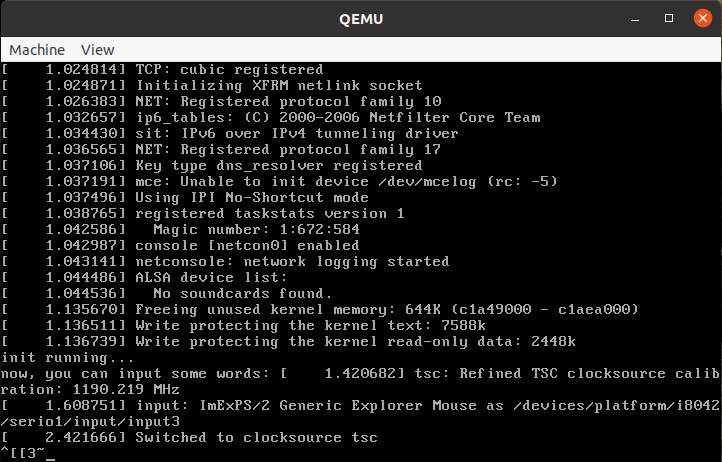

<head><meta charset="UTF-8"></head>
<style>
h1 {
    text-align: center;
    border-left: 5px solid #e86422;
    border-right: 5px solid #e86422;
}
h2 {
    border-left: 5px solid #ff7f00;
    padding-left: 10px;
}
h3 {
    border-left: 5px solid #e86422;
    padding-left: 8px;
}
h4 {
    border-left: 3px solid #f0a000;
    padding-left: 5px;
}
</style>

Release log:  
> 2021-04-18 日: 完成初版  

[原文地址](https://github.com/wax5798/blog/blob/master/tools/qemu/1_%E5%A6%82%E4%BD%95%E4%BD%BF%E7%94%A8qemu%E5%88%86%E6%9E%90linux%E5%86%85%E6%A0%B8.md)

# 如何使用 qemu + gdb 分析 Linux 内核代码

## 环境说明
> 操作系统:			Ubuntu 20.04.2 LTS(lsb_release  -a)  
> 内核版本:			5.4.0-58-generic(uname -a)   
> qemu 版本:		QEMU emulator version 4.2.1 (Debian 1:4.2-3ubuntu6.15)  
> linux 源码:		linux-3.18.6  

## qemu 简介以及安装
Qemu 是纯软件实现的虚拟化模拟器，几乎可以模拟任何硬件设备，我们最熟悉的就是能够模拟一台能够独立运行操作系统的虚拟机，虚拟机认为自己和硬件打交道，但其实是和 Qemu 模拟出来的硬件打交道，Qemu 将这些指令转译给真正的硬件

至于怎么安装 qemu，因为之前没有记录步骤，这里就不描述了，网上资料很多

## 准备环境
在运行 qemu 之前，我们需要准备好内核镜像文件以及一个简易的内存根文件系统

#### 编译内核
首先我们需要下载 linux 内核源码，我使用的是 [linux-3.18.6.tar.gz](https://mirrors.edge.kernel.org/pub/linux/kernel/v3.x/linux-3.18.6.tar.gz)。如果你们需要其他版本的源码，可以 [点击这里](https://mirrors.edge.kernel.org/pub/linux/kernel)

下载完成之后，解压文件，然后编译内核镜像，得到一个不带调试信息的 bzImage 文件，命令如下。(我的是 64 位系统，但是想编译成 32 位的镜像)
```
$ tar -xvzf linux-3.18.6.tar.gz
$ cd linux-3.18.6/
$ make i386_defconfig
$ make
```

#### 制作文件系统
内核启动之后，会加载根文件系统中名为 init 的可执行文件。搭建完善的根文件系统会比较麻烦，此处我们制作一个简化的内存根文件系统。步骤如下
> 1、创建一个名为 rootfs 的目录: make rootfs  
> 2、创建一个 init.c 的文件以及 Makefile 文件，文件内容如下  
> 3、执行 make 命令，生成 rootfs.img 文件

```
// rootfs/init.c
#include <stdio.h>
#include <stdlib.h>
#include <stdint.h>


int main(int argc, char *argv[])
{
	char inStr[256] = {0};
	printf("init running...\n");
	while (1)
	{
		printf("now, you can input some words: ");
		fgets(inStr, sizeof(inStr), stdin);
		printf("%s\n", inStr);
	}
	return 0;
}


// rootfs/Makefile
all:
	gcc-9 myinit.c -o init -static -m32
	find init | cpio -o -Hnewc |gzip -9 > ./rootfs.img
```


## 使用 qemu 运行内核
使用命令加载并运行内核: `qemu-system-i386 -kernel linux-3.18.6/arch/x86/boot/bzImage -initrd rootfs/rootfs.img`



说明： qemu 需要使用图形化界面运行，使用 -nographic 参数会导致加载内核失败

## 使用 qemu + gdb 分析内核流程
#### 编译带有调试信息的内核镜像
在上面我们编译的内核镜像是不带调试信息的，如果想借助 qemu + gdb 分析内核流程，需要重新编译内核，使内核镜像带有调试信息。编译步骤如下
```
$ make i386_defconfig
$ make menucomfig
	Kernel hacking --->
		Compile-time checks and compiler options --->
			[*] Compile the kernel with debug info
$ make
```

关于 make menuconfig，相信大家应该是知道的，网上也有不少资料。如果执行 make menuconfig 提示错误，网上也有不少资料

#### 跟踪调试内核
使用 gdb 跟踪调试内核，启动 qemu 时需要加两个参数，一个是 -s(在 1234 端口上创建一个 gdb-server)，另一个是 -S（CPU 初始化之前冻结起来)。则启动 qemu 的命令变成了: `qemu-system-i386 -kernel linux-3.18.6/arch/x86/boot/bzImage -initrd rootfs/rootfs.img -s -S`

在另一个窗口启动 gdb，把内核加载经来，建立连接
```
$ gdb
	(gdb) file linux-3.18.6/vmlinux
	(gdb) target remote:1234
```

我们可以设置断点为 start_kernel(void)，在这个函数之前，内核代码主要是汇编语言写的。然后执行 c 开始运行
```
(gdb) b start_kernel
(gdb) c
```

使用 gdb 跟进，会发现在 start_kernel->rest_init 中创建内核线程，在这个线程中执行 kernel_init。
```
	if (ramdisk_execute_command) {
		ret = run_init_process(ramdisk_execute_command);
		if (!ret)
			return 0;
		pr_err("Failed to execute %s (error %d)\n",
		       ramdisk_execute_command, ret);
	}
```

ramdisk_execute_command 指向 "init"，即我们前面创建的可执行文件。调用 run_init_process 创建 init 进程

## 小知识
#### 区分 vmlinux bzImage zImage
> vmlinux 是编译出来的最原始的 ELF 文件  
> bzImage 和 zImage 是 vmlinux 经过 gzip 压缩后的文件，b 代表 big，bzImage 解压缩内核到高端内存(1M以上)，适用于大内核，也可用于小内核；老的 zImage 解压缩内核到低端内存(第一个640K)，适用于小内核，不能用于大内核  
> bzImage 和 zImage 不仅是一个压缩文件，而且在这两个文件的开头部分内嵌有 gzip 解压缩代码。所以你不能用 gunzip 或 gzip –dc 解包

## 问题归总
> 1、编译内核时遇到一些编译问题，把 gcc 版本降到 4.7.4 之后解决了  
> 2、使用 gcc -m32 选项编译 init.c 时，会提示错误: skipping incompatible /usr/lib/gcc/x86_64-linux-gnu/4.7/libgcc.a when searching for -lgcc。原因是没有安装 lib32gcc-4.7-dev，并且 ubuntu 20.04 中 apt 不能直接安装这个库。此处可以使用 gcc-9 -m32 来编译  
> 3、使用 qemu 直接加载内核时，会以图形化界面运行。如果鼠标点击 qemu，鼠标和键盘都会被 qemu 占用且不能切换出来。试了网上的很多方法都不顶用（比如，先按 Ctrl-a，再按 x；比如 Ctrl-Alt）。只能使用 Ctrl-Alt-q 强制关闭 qemu。目前没有找到在不强制关闭 qemu 的情况下，在 qemu 与主机之间自由切换鼠标的方法。如果有知道的朋友，望告知，谢谢

## 参考
《庖丁解牛Linux内核分析》
